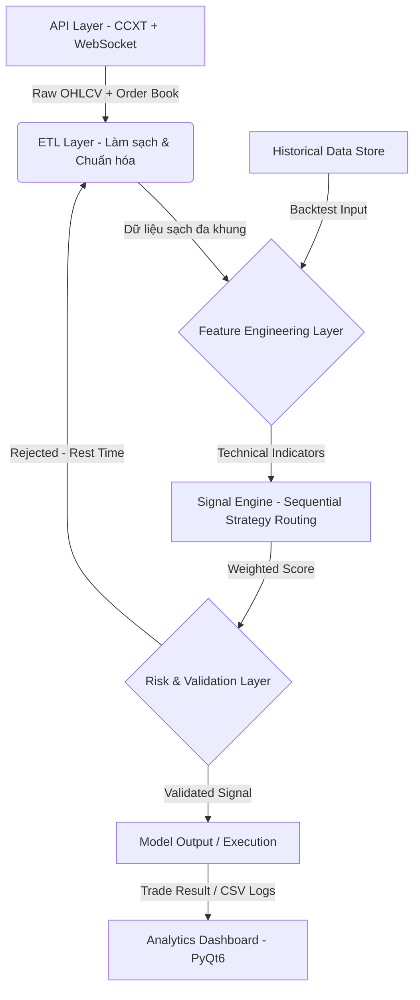

<div align="center">
 


# Kairos v1
### **End-to-End Data Analytics Pipeline for Financial Market Research**

[](https://www.python.org/)
[](https://www.binance.com/)
[](https://opensource.org/licenses/MIT)

`Python` • `Pandas` • `Polars` • `ETL Pipeline` • `Time-Series` • `Feature Engineering`

</div>
<div align="left">
 
-----

### Data Skills Highlights

* **End-to-End ETL Pipeline:** Thiết kế pipeline tự động từ Raw API → Clean Dataset — thu thập OHLCV đa khung (1m–1d), chuẩn hóa timestamp, xử lý gaps và missing candles từ 3 sàn (Binance, OKX, Bybit) đồng thời qua CCXT + WebSocket.
* **Multi-Timeframe Feature Engineering (không look-ahead):** Trích xuất 48 chỉ báo kỹ thuật trên 8 khung thời gian song song. Giải quyết bài toán time-alignment nghiêm ngặt: mỗi bar chỉ nhìn thấy dữ liệu đã thực sự xảy ra tại thời điểm đó — cơ chế `resample + shift index + forward-fill + live candle` đảm bảo không có data leakage.
* **High-Performance Processing:** Sử dụng thư viện Polars để tối ưu hóa tính toán các chỉ báo kỹ thuật — xử lý hiệu năng cao, giảm thiểu đáng kể thời gian tính toán so với cách tiếp cận vòng lặp thông thường.
* **Statistical Backtesting Framework:** Thiết kế backtest như hypothesis testing — walk-forward split, look-ahead bias prevention ở cả data pipeline lẫn execution logic (signal tại bar N, entry tại open bar N+1), dual-engine cross-validation.
* **Interactive Analytics Dashboard (PyQt6):** Equity curve, drawdown chart, daily PnL calendar, session heatmap (win rate theo giờ × ngày), trade scatter plot — biến kết quả số thô thành visual insights có thể ra quyết định.

-----

### Minh họa Analytics Dashboard


-----

## Kết quả đạt được (Key Results)

- Xây dựng pipeline xử lý dữ liệu lịch sử **hàng triệu dòng** trên nhiều năm, nhiều cặp tài sản song song
- Tăng tốc phân tích bằng Polars: giảm thiểu tối đa thời gian xử lý cho khối lượng dữ liệu lớn
- Feature engineering đa khung thời gian không look-ahead bias — điều kiện bắt buộc cho mô phỏng dữ liệu thực
- Tự động hóa toàn bộ vòng đời dữ liệu: **Thu thập → Xử lý → Phân tích → Trực quan hóa**

## Mục lục (Table of Contents)

1. [Tầm nhìn & Phương pháp luận](#1)
2. [Tổng quan hệ thống](#2)
3. [Kỹ năng & Công nghệ cốt lõi](#3)
4. [Kiến trúc Pipeline Dữ liệu](#4)
5. [Feature Engineering & Hệ thống Chấm điểm Tín hiệu](#5)
6. [Analytics Dashboard & Trực quan hóa](#6)
7. [Lưu trữ Dữ liệu & Lịch sử Lệnh](#7)
8. [Quản trị Rủi ro & Kiểm soát Chất lượng Mô hình](#8)
9. [Cấu trúc thư mục](#9)
10. [Yêu cầu & Hướng dẫn cài đặt](#10)
11. [Hướng dẫn cấu hình & Khởi chạy](#11)
12. [Lộ trình phát triển](#12)
13. [Hướng dẫn nghiên cứu chiến lược từ đầu](#13)
14. [Cảnh báo rủi ro](#14)
15. [Chia sẻ của tác giả](#15)
16. [Tài liệu kỹ thuật chuyên sâu](#16)

-----

<a name="1"></a>

## 1. TẦM NHÌN & PHƯƠNG PHÁP LUẬN

**KAIROS QUANT SYSTEM** là một **Hệ thống Phân tích Dữ liệu end-to-end** ứng dụng vào bài toán nghiên cứu thị trường tài chính — nơi mọi quyết định đều phải được kiểm chứng bằng dữ liệu, không dựa vào trực giác hay cảm tính.

Triết lý xây dựng hệ thống:  
**"Dữ liệu là sự thật duy nhất. Mọi giả thuyết đều phải qua kiểm định thống kê."**

### Bài toán cốt lõi

1. **Thu thập & chuẩn hóa:** Dữ liệu đến từ nhiều nguồn, nhiều tần suất, nhiều múi giờ → cần pipeline ETL nhất quán.
2. **Feature Engineering:** Từ raw price data → trích xuất tín hiệu có giá trị dự báo mà không bị nhiễu bởi look-ahead bias.
3. **Kiểm định mô hình:** Chiến lược "hoạt động tốt trên giấy" có thể thất bại thực tế nếu backtest không nghiêm ngặt — cần framework kiểm định đúng chuẩn.
4. **Ra quyết định tự động:** Sử dụng các quy tắc thống kê định lượng (statistical rules) kết hợp đa chiến lược thành hệ thống điều phối có thể giải thích được (explainable).

| Giai đoạn | Phương pháp |
|---|---|
| Thu thập dữ liệu | REST API + WebSocket streaming, đa sàn giao dịch |
| Tiền xử lý | Resampling đa khung, fill NA, timestamp alignment |
| Feature Engineering | 48 chỉ báo trên 8 timeframes, MTF alignment |
| Kiểm định | Walk-forward backtest, look-ahead bias prevention |
| Định tuyến chiến lược | Sequential Multi-Strategy Scoring (5 chiến lược) |
| Trực quan hóa | Interactive dashboard: equity curve, heatmap, PnL scatter |

-----

<a name="2"></a>

## 2. TỔNG QUAN HỆ THỐNG

**KAIROS** là một **Data Analytics Pipeline hoàn chỉnh** — bao phủ toàn bộ vòng đời dữ liệu từ thu thập, xử lý, phân tích, mô hình hóa đến trực quan hóa kết quả.

Hệ thống được xây dựng theo nguyên tắc **"mỗi `def` là một module độc lập"**: từng hàm chỉ làm đúng một việc, nhận input rõ ràng và trả về output xác định — không phụ thuộc trạng thái bên ngoài. Kiến trúc này đảm bảo từng bước trong pipeline đều có thể **chạy độc lập, kiểm tra riêng lẻ và tái sử dụng tự do**.

### 6 chế độ vận hành — chọn qua CLI menu

Khởi động bằng `python main.py`, hệ thống hiện menu để chọn chế độ:

| # | Chế độ | Mô tả |
|---|--------|-------|
| 1 | **Giao dịch Realtime** | Kết nối sàn thật, thực thi lệnh qua CCXT |
| 2 | **Demo / Paper Trading** | Pipeline đầy đủ, không đặt lệnh thật |
| 3 | **Backtest Đơn luồng** | Bar-to-bar simulation, 1 CPU thread |
| 4 | **Backtest Đa luồng** | Bar-to-bar parallel, nhiều symbol song song |
| 5 | **Dashboard Analytics** | Giao diện PyQt6 — equity curve, heatmap, PnL scatter |

-----

<a name="3"></a>

## 3. KỸ NĂNG & CÔNG NGHỆ CỐT LÕI

### Data Engineering & Pipeline

| Kỹ năng | Ứng dụng trong dự án |
|---|---|
| **ETL Design** | Thu thập → validate → transform → store dữ liệu OHLCV từ 3 sàn |
| **Time-Series Processing** | Resampling đa khung, timestamp alignment, fill NA strategy |
| **Data Quality** | Phát hiện gaps, outliers, corrupt candles; look-ahead bias prevention |
| **Performance Optimization** | Tối ưu hiệu năng với Polars: tăng tốc đáng kể so với loop-based approach |
| **Streaming Data** | WebSocket pipeline: CVD, order book depth, funding rate, liquidation |

### Feature Engineering — 48 chỉ báo trên 8 khung thời gian

| Nhóm | Chỉ báo | Số lượng |
| --- | --- | :---: |
| **Trend** | EMA, SMA, ADX, Ichimoku, SuperTrend, MACD, Parabolic SAR, Aroon, Vortex | 9 |
| **Momentum** | RSI, Stochastic %K/%D, CCI, Williams %R, ROC, MFI, Awesome Oscillator, TSI, Ultimate Oscillator | 9 |
| **Volatility** | ATR, Bollinger Bands + Squeeze, Keltner Channel, Donchian Channel, Historical Volatility, Chaikin Volatility, ATR Bands | 7 |
| **Volume** | Volume MA, Volume MA Dual, OBV, VWAP, Volume Profile (POC/VAH/VAL), CMF, A/D Line, MFI Volume, Ease of Movement | 9 |
| **Price Structure** | Breakout, ZigZag, Fractals, Pivot Points, FVG, Heikin Ashi, Market Structure (BOS/CHoCH), Order Blocks, Support/Resistance | 9 |
| **Market Sentiment** | CVD, Funding Rate, Order Book Imbalance, Liquidation Data | 4 |
| **Session & Cycle** | Asian / London / New York session, Session Range H/L | 2 |

> 📖 *Chi tiết từng chỉ báo (công thức, mô tả) → xem [Engine Chiến Lược & Chỉ Báo](tai_lieu_chi_tiet.md#chien_luoc) trong tài liệu kỹ thuật.*


### Visualization & Analytics

* **Dashboard:** PyQt6 interactive — equity curve, drawdown, trade scatter, session heatmap
* **Charting:** Candlestick + multi-indicator overlay, entry/exit markers
* **Reporting:** Daily PnL, win rate by hour/day, hold duration distribution

-----

<a name="4"></a>

## 4. KIẾN TRÚC PIPELINE DỮ LIỆU

Hệ thống được phân tách rõ ràng thành các tầng độc lập (Separation of Concerns), dễ test và mở rộng từng module.



**Tầng 1 — Data Acquisition (`/lay_du_lieu`):** ETL layer kết nối REST API + WebSocket để kéo dữ liệu OHLCV đa khung, snapshot order book, và macro data (OI, Fear & Greed Index).

**Tầng 2 — Feature Engineering (`/logic_bar_to_bar/phan_tich_ky_thuat`):** Trích xuất 48 chỉ báo kỹ thuật trên 8 khung thời gian song song (không có look-ahead bias).

**Tầng 3 — Signal Engine (`/logic_bar_to_bar`):** Điều phối và thực thi các chiến lược giao dịch. 5 chiến lược (Breakout, Squeeze, Trend Following, Mean Reversion, Scalping) chấm điểm độc lập, tín hiệu được định tuyến tuần tự để tìm cơ hội vào lệnh.

**Tầng 4 — Analytics Layer (`/hien_thi`):** Dashboard PyQt6 trực quan hóa kết quả: equity curve, drawdown, trade analysis, session heatmap.

> 📖 *Chi tiết từng module trong mỗi tầng → xem [Tài liệu kỹ thuật chi tiết](tai_lieu_chi_tiet.md).*

-----

<a name="5"></a>

## 5. FEATURE ENGINEERING & HỆ THỐNG CHẤM ĐIỂM TÍN HIỆU

### Multi-Timeframe Data Pipeline — Tóm tắt Nguyên Lý

Thách thức cốt lõi của tính toán đa khung là **time-alignment**: ở mỗi bar 1m, indicator HTF phải phản ánh chính xác những gì bot có thể biết tại thời điểm đó. Hệ thống dùng một nguồn dữ liệu duy nhất là raw 1m OHLCV, sau đó dẫn xuất toàn bộ 8 khung từ đó.

**Quy trình 4 bước chống look-ahead bias trong mỗi hàm tính chỉ báo:**
1. **Resample** — Dựng nến đóng HTF từ dữ liệu 1m
2. **Shift index** — Dữ liệu nến HTF đóng lúc T chỉ được nhìn thấy từ T+period (chống look-ahead)
3. **Forward-fill** — Mỗi bar 1m thấy giá trị cuối cùng của nến HTF đã được phép biết
4. **Live indicator** — Tính indicator kết hợp lịch sử đã lock + close 1m hiện tại

> 📖 *Chi tiết sơ đồ pipeline, giải thích shift, ví dụ cụ thể Bollinger Bands 15m, và các lỗi look-ahead phổ biến → xem [Engine Chiến Lược & Chỉ Báo](tai_lieu_chi_tiet.md#chien_luoc) trong tài liệu kỹ thuật.*

### Ensemble Scoring — Hệ thống chấm điểm có trọng số

Thay vì dùng một rule đơn lẻ, KAIROS kết hợp nhiều góc nhìn phân tích độc lập:

| Module | Chức năng phân tích | Trọng số điển hình |
|---|---|---|
| `xu_huong.py` | EMA alignment, ADX strength, trend structure | Cao (khung 1h) |
| `cau_truc_gia.py` | Breakout, Fractal, FVG, Support/Resistance | Cao (khung 4h) |
| `khoi_luong.py` | Volume surge, OBV, VWAP deviation | Trung bình |
| `dong_luong_dao_chieu.py` | RSI divergence, MACD, momentum exhaustion | Trung bình |
| `bien_dong.py` | ATR regime, Bollinger squeeze, Keltner | Thấp–Trung bình |
| `vi_the.py` | CVD, Funding Rate, Order Book Imbalance | Xác nhận |
| `chu_ky.py` | Session classification, funding hour filter | Lọc |

**Formula tổng hợp:**
```
Total Score = Σ (Feature_Score_i × Weight_i × Timeframe_Multiplier)
Signal = BUY  nếu Total Score ≥ Threshold
         SELL nếu Total Score ≤ -Threshold
         HOLD otherwise
```

Các chiến lược sử dụng các bộ chỉ báo có trọng số cố định được tối ưu hóa qua quá trình backtest để thích nghi với các điều kiện thị trường khác nhau.


<a name="6"></a>

## 6. ANALYTICS DASHBOARD & TRỰC QUAN HÓA

KAIROS tích hợp ứng dụng Desktop (PyQt6) với các dashboard phục vụ phân tích hiệu suất:

### 6.1 Backtest Analytics Dashboard

Phân tích hiệu suất sau khi chạy backtest — `hien_thi/dashboard_backtest.py`

* **Equity Curve & Drawdown Chart:** Đường cong vốn tích lũy + underwater chart, phân tích risk-adjusted performance theo thời gian.
* **Daily PnL Calendar:** Lợi nhuận theo từng ngày dạng calendar view, click để drill-down từng lệnh trong ngày.
* **Session Heatmap:** Ma trận nhiệt Win Rate theo Giờ × Ngày trong tuần — trả lời "lúc nào model hoạt động tốt nhất?".
* **Trade Scatter Plot:** Phân tán Hold Duration × PnL — phát hiện pattern "cắt lời sớm / gồng lỗ" từ data.


-----

### 7.2 Demo / Live Monitor

Theo dõi real-time khi chạy Demo hoặc Live — `hien_thi/dashboard_demo.py` / `hien_thi/dashboard_realtime.py`

* **Market Heatmap:** Màu đỏ/xanh theo tín hiệu của từng symbol trên 7 khung thời gian (1m → 1d).
* **Vị thế đang mở:** Symbol, chiều (Buy/Sell), giá vào, size, thời gian giữ lệnh.
* **Lịch sử lệnh:** PnL từng lệnh kèm lý do đóng — SL hit, TP hit, hay tín hiệu đảo chiều.
* **Equity real-time:** Cập nhật liên tục theo từng lệnh đóng.

-----

<a name="8"></a>

## 8. LƯU TRỮ DỮ LIỆU & LỊCH SỬ LỆNH

Sau mỗi lần chạy, kết quả giao dịch và lịch sử lệnh được tự động lưu trữ dưới các định dạng file chuẩn để phục vụ phân tích:

* **Kết quả Backtest:** Được lưu tự động thành file CSV trong thư mục `du_lieu/thong_tin_lenh/ket_qua_backtest_*.csv` (đối với đơn luồng) và `du_lieu/lich_su_gia/ket_qua_backtest_daluong_*.csv` (đối với đa luồng).
* **Kết quả Demo / Realtime:** Được lưu trữ dưới dạng JSON phục vụ cho việc quản lý vị thế và khôi phục trạng thái hoạt động của bot.

Các dữ liệu này được nạp trực tiếp vào Dashboard PyQt6 để trực quan hóa hiệu quả chiến lược mà không cần qua hệ thống cơ sở dữ liệu cồng kềnh.

> 📖 *Chi tiết về cấu trúc lưu trữ và cách đọc dữ liệu → xem [Lưu trữ dữ liệu](tai_lieu_chi_tiet.md#du_lieu) trong tài liệu kỹ thuật.*

-----

<a name="9"></a>

## 9. QUẢN TRỊ RỦI RO & KIỂM SOÁT CHẤT LƯỢNG MÔ HÌNH

* **Look-ahead Bias Prevention:** Mọi feature đều được tính trước thời điểm tín hiệu. Dữ liệu train/test được chia theo walk-forward (không random shuffle).
* **Overfitting Detection:** Drawdown limit tự động dừng mô hình khi performance thực tế lệch xa backtest.
* **Dynamic SL/TP (ATR %):** Stop-loss tính theo ATR, clamp trong biên an toàn (SL: 0.5%–15%, TP: 1%–30%).
* **Multi-factor Dynamic Leverage:** Đòn bẩy kết hợp 5 nhân tố: ATR, ADX, Volume surge, Breakout signal, Bollinger Squeeze. Kết quả được clamp trong `[1, max_leverage]`.
* **Robustness Testing:** Kiểm thử mô hình trên nhiều cặp tài sản, nhiều giai đoạn thị trường khác nhau (bull/bear/ranging).

> 📖 *Chi tiết công thức SL/TP động, đòn bẩy đa nhân tố, và cơ chế bảo vệ vốn → xem [Engine Chiến Lược & Chỉ Báo](tai_lieu_chi_tiet.md#chien_luoc) trong tài liệu kỹ thuật.*

-----

<a name="10"></a>

## 9. CẤU TRÚC THƯ MỤC

```text
Kairos-v1/
├── main.py                              # Entry point – menu điều hướng các chế độ
├── requirements.txt
│
├── config/                              # CẤU HÌNH HỆ THỐNG
│   ├── cau_hinh_giao_dich.yaml          # Assets, khung thời gian, tham số rủi ro
│   ├── cau_hinh_ao_config.json          # Cấu hình môi trường simulation/backtest
│   ├── tai_khoan_api.json               # API credentials (gitignore)
│   ├── tai_khoan_api.json.example       # Template cấu hình API
│   └── thong_tin_san.yaml               # Exchange metadata (min lot, tick size)
│
├── lay_du_lieu/                         # ETL LAYER – Thu thập & Chuẩn hóa Dữ liệu
│   ├── lay_ohlcv.py                     # OHLCV lịch sử + đa khung thời gian (CCXT)
│   ├── lay_marketsnapshot.py            # WebSocket: CVD, order book, liquidation
│   ├── lay_macro.py                     # Macro data: OI, Fear & Greed Index
│   └── lay_thong_tin_tai_khoan.py       # Số dư, vị thế, lịch sử lệnh
│
├── logic_bar_to_bar/                    # FEATURE ENGINEERING & SIGNAL LAYER (Bar-to-bar)
│   ├── phan_tich_ky_thuat/              # 7 module chỉ báo (48 indicators)
│   ├── chien_luoc/                      # 5 chiến lược (bar-to-bar scoring)
│   ├── quan_ly_chien_luoc.py            # Điều phối và định tuyến 5 chiến lược giao dịch
│   ├── chien_luoc_don_bay.py            # Đòn bẩy động đa nhân tố
│   ├── stoploss_takeprofit.py           # SL/TP động (ATR-scaled)
│   └── chien_luoc_trang_thai_thi_truong.py # Bộ lọc trạng thái thị trường (thời gian + dữ liệu)
│
├── chuc_nang/                           # PIPELINE RUNNERS
│   ├── chay_realtime.py                 # Chạy bot thật (live trading)
│   ├── chay_demo.py                     # Forward test không rủi ro
│   ├── backtest_donluong.py             # Bar-to-bar backtest (1 luồng)
│   └── backtest_daluong.py              # Bar-to-bar backtest (đa luồng)
│
├── thuc_thi_lenh/                       # ORDER EXECUTION LAYER
│   ├── bo_may_thuc_thi.py               # Singleton quản lý kết nối sàn
│   ├── mo_lenh.py / dong_lenh.py        # Mở/đóng lệnh (market/limit)
│   ├── quan_ly_lenh.py                  # Quản lý trạng thái lệnh đang mở
│   └── ket_noi_san/                     # Binance, Bybit, OKX connectors
│
├── hien_thi/                            # ANALYTICS DASHBOARD (PyQt6)
│   ├── dashboard_backtest.py            # Equity curve, drawdown, PnL scatter
│   ├── dashboard_realtime.py            # Live monitoring
│   └── dashboard_demo.py                # Forward-test performance tracking
├── thong_bao/                           # NOTIFICATIONS
├── utils/                               # UTILITIES (Helpers, Logger)
└── du_lieu/                             # DATA STORAGE
```

-----

<a name="10"></a>

## 10. YÊU CẦU & HƯỚNG DẪN CÀI ĐẶT

```bash
git clone <repo>
cd kairos-v1
pip install -r requirements.txt
```

**Thư viện chính:**

| Thư viện | Mục đích |
|---|---|
| `pandas`, `polars` | Data processing & feature engineering |
| `numpy` | High-performance array operations |
| `ccxt` | Exchange API connector — Binance, OKX, Bybit |
| `pyqt6`, `pyqtgraph`, `matplotlib` | Analytics dashboard & charting |
| `websocket-client` | Streaming data pipeline |
| `rich` | Structured terminal logging |

-----

<a name="11"></a>

## 11. HƯỚNG DẪN CẤU HÌNH & KHỞI CHẠY

### 11.1 Cấu hình & Khởi chạy Menu chính

Sao chép template API keys và tùy chỉnh cấu hình giao dịch:
```bash
cp config/tai_khoan_api.json.example config/tai_khoan_api.json
# Sửa config/cau_hinh_giao_dich.yaml — chọn sàn, cặp tiền, đòn bẩy, phân bổ vốn
python main.py
```

Hệ thống sử dụng thư viện `rich` để xây dựng CLI Dashboard tương tác trực quan:

```text
 ┌────────────────────────────────────────────────────────────────────────────────────────┐
 │                     ██╗  ██╗ █████╗ ██╗██████╗  ██████╗ ███████╗                       │
 │                     ██║ ██╔╝██╔══██╗██║██╔══██╗██╔═══██╗██╔════╝                       │
 │                     █████╔╝ ███████║██║██████╔╝██║   ██║███████╗                       │
 │                     ██╔═██╗ ██╔══██║██║██╔══██╗██║   ██║╚════██║                       │
 │                     ██║  ██╗██║  ██║██║██║  ██║╚██████╔╝███████║                       │
 │                     ╚═╝  ╚═╝╚═╝  ╚═╝╚═╝╚═╝  ╚═╝ ╚═════╝ ╚══════╝                       │
 │                                  Analytics System v1                                   │
 ├──────────────────────────────────────────────┬─────────────────────────────────────────┤
 │  Menu                                        │  Config hiện tại                        │
 │  ──────────────────────────────────────────  │  ────────────────────────────────────── │
 │  LIVE TRADING                                │  Symbols:   BTC/USDT, ETH/USDT...       │
 │  [1] Giao dịch Realtime   (Thật · CCXT)      │  Đòn bẩy:   7x                          │
 │  [2] Demo / Paper Trading (Không rủi ro)     │  Backtest:  2024-01-01 → 2024-12-31     │
 │                                              │  Vốn:       10,000 USDT                 │
 │  BACKTESTING                                 ├─────────────────────────────────────────┤
 │  [3] Backtest Đơn luồng   (Bar-to-bar 1-CPU) │  Tác giả                                │
 │  [4] Backtest Đa luồng    (Song song đa-CPU) │  P. Vinh - Quant Research & Dev         │
 │                                              │                                         │
 │  ANALYTICS                                   │  "Romain Rolland: 'There is only one    │
 │  [5] Dashboard Analytics  (PyQt6 GUI)        │   heroism in the world: to see the      │
 │                                              │   world as it is, and to love it.'"     │
 │  OPTIMIZATION                                │  ────────────────────────────────────── │
 │  [6] Tối ưu hóa tham số                      │  Kairos v1 · 2026                       │
 │                                              │─────────────────────────────────────────┘
 │  [0] Thoát                                   │   
 └──────────────────────────────────────────────┘
```

> [!NOTE]
> Hệ thống áp dụng cơ chế **Lazy Import**: Chỉ nạp thư viện nặng (PyQt6, CCXT) khi chức năng tương ứng được chọn. Tốc độ khởi chạy menu CLI < 100ms.

-----

<a name="12"></a>

## 12. LỘ TRÌNH PHÁT TRIỂN

*Đây là đề xuất cá nhân của tác giả, không phải cam kết.*

Tác giả sẽ **hạn chế phát triển thêm Kairos v1** để tập trung vào **Kairos-v3**. Hướng đề xuất cuối cùng cho v1:

**Dùng dữ liệu phi OHLCV làm bộ lọc cho live trading** — kết nối funding rate, CVD, OI, liquidation (đã có sẵn module trong `/lay_du_lieu/`) vào pipeline ra quyết định. Không phải để tìm edge mới, mà để tránh vào lệnh đúng kỹ thuật nhưng sai thời điểm.

Thứ tự thực hiện: Ổn định chiến lược OHLCV trước → Hook dữ liệu phi OHLCV vào `chien_luoc_trang_thai_thi_truong.py` → Chỉ test trong Demo/Live (không backtest được).

-----

<a name="13"></a>

## 13. HƯỚNG DẪN NGHIÊN CỨU CHIẾN LƯỢC TỪ ĐẦU

Quy trình chuẩn để phát triển và kiểm định một ý tưởng giao dịch trong KAIROS:

```
Lấy dữ liệu lịch sử
        │
        ▼
Nghiên cứu chiến lược (logic_bar_to_bar)
        │
        ▼
   Bar-to-bar Backtest  ← Kiểm chứng chi tiết
        │
        ▼
   Demo / Paper Trading ← Thị trường thật, không rủi ro
        │
        ▼
       Live Trading     ← Vốn thật, quy mô nhỏ trước
```

**4 giai đoạn tuần tự:**

1. **Lấy dữ liệu lịch sử** — Thu thập OHLCV nhiều năm, nhiều symbol. Kiểm tra không gap lớn, volume > 0.
2. **Nghiên cứu chiến lược** — Thiết kế logic tín hiệu trong `logic_bar_to_bar/chien_luoc/`.
3. **Bar-to-bar Backtest** — Mô phỏng sát thực tế (SL/TP chính xác, partial fill).
4. **Demo → Live** — Chạy ít nhất 2–4 tuần Demo trước khi Live. Bắt đầu với 10–20% vốn dự kiến.

-----

<a name="14"></a>

## 14. CẢNH BÁO RỦI RO

**Về kết quả backtest:** Toàn bộ kết quả dựa trên dữ liệu lịch sử. Kết quả đó **không đảm bảo hiệu suất trong tương lai**. Thị trường thay đổi cấu trúc theo thời gian.

**Về giới hạn của hệ thống:** Backtest mô phỏng theo bar, không tick-by-tick. Slippage/fee ước lượng cố định. Dữ liệu orderflow chỉ khả dụng trong Demo/Live.

**Về mục đích sử dụng:** Dự án phục vụ mục đích **nghiên cứu, học tập và thử nghiệm phương pháp luận phân tích định lượng**. Không phải khuyến nghị đầu tư.

-----


-----

<a name="15"></a>

## 15. CHIA SẺ CỦA TÁC GIẢ

Tôi không bắt đầu dự án này vì muốn trở thành trader. Tôi bắt đầu vì thị trường tài chính là một trong số ít bài toán dữ liệu trả lời thẳng thắn: nếu code sai, backtest sẽ nói ngay. Nếu tư duy sai, thực tế sẽ không nể nang.

Kairos v1 là phiên bản sơ khai nhất trong chuỗi nghiên cứu của tôi. Khác với các phiên bản sau này, bản v1 chạy hoàn toàn trên cơ chế mô phỏng từng nến (bar-to-bar). Do đó, một hạn chế rất lớn là việc backtest và kiểm chứng chiến lược từ dữ liệu lịch sử siêu lâu sẽ tốn rất nhiều thời gian xử lý do thiếu đi engine vectorized tối ưu hóa. Tuy nhiên, tính nguyên bản và trực quan của mô phỏng bar-to-bar giúp người học dễ dàng debug và hiểu sâu sắc từng bước khớp lệnh thực tế.

Bên cạnh những hạn chế về hiệu năng, dự án vẫn giữ nguyên các quyết định thiết kế chuẩn xác ngay từ đầu: cơ chế vào lệnh tại giá Open của bar N+1 để loại bỏ hoàn toàn Look-Ahead bias.

Kairos v1 sẽ ở lại như nó đang là — trung thực về những gì nó làm được và không làm được, một cột mốc bắt đầu đầy giá trị cho việc tiếp cận phân tích định lượng.

*Đôi khi con đường thẳng nhất đến nơi bạn muốn đến lại là con đường vòng qua chỗ bạn cần phải sai trước.*

-----

<a name="16"></a>

## 16. TÀI LIỆU KỸ THUẬT CHUYÊN SÂU

Mọi chi tiết triển khai, mô tả giải thuật, cấu trúc cơ sở dữ liệu và hướng dẫn vận hành chuyên sâu được tài liệu hóa đầy đủ tại:

📖 **[Hướng dẫn kỹ thuật chi tiết — Technical Reference Manual](tai_lieu_chi_tiet.md)**

| Mục | Nội dung | Link |
|---|---|---|
| Cấu hình hệ thống | YAML, JSON, API keys, gitignore | [→ Chi tiết](tai_lieu_chi_tiet.md#config) |
| Tầng thu thập dữ liệu | WebSocket streams, ETL, macro data | [→ Chi tiết](tai_lieu_chi_tiet.md#lay_du_lieu) |
| Engine chiến lược & Chỉ báo | 48 chỉ báo, look-ahead prevention, MTF alignment | [→ Chi tiết](tai_lieu_chi_tiet.md#chien_luoc) |
| Thực thi lệnh | Order Execution, Position Manager, Hedge Mode | [→ Chi tiết](tai_lieu_chi_tiet.md#thuc_thi_lenh) |
| Kịch bản vận hành | 4 luồng chạy backtest và live trading | [→ Chi tiết](tai_lieu_chi_tiet.md#chuc_nang) |
| Dashboard PyQt6 | Biểu đồ phân tích, theme Pro Terminal | [→ Chi tiết](tai_lieu_chi_tiet.md#hien_thi) |
| Lưu trữ dữ liệu | CSV, JSON | [→ Chi tiết](tai_lieu_chi_tiet.md#du_lieu) |
| Hệ thống cảnh báo | Telegram & Email notifications | [→ Chi tiết](tai_lieu_chi_tiet.md#thong_bao) |

-----

### THÔNG TIN TÁC GIẢ

* **Tác giả:** P Vinh
* **Vai trò:** Financial Data Analyst · Quant Developer
* **Stack:** Python · Pandas · Polars · PyQt6 · CCXT
* **Phương pháp:** Data-driven design · Statistical validation · Human logic + AI-assisted development
* **Contact:** ppvinh1513@gmail.com

*"Romain Rolland: 'There is only one heroism in the world: to see the world as it is, and to love it.'"*

</div>
